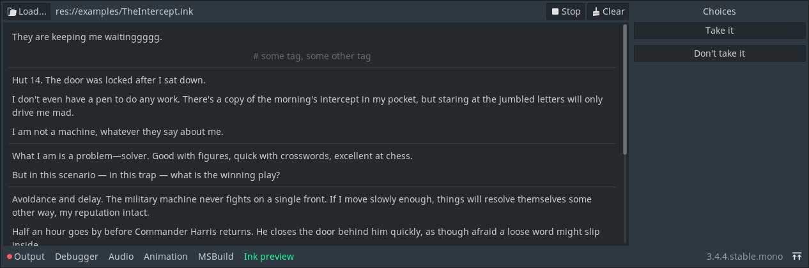

# godot-ink

An [ink](https://github.com/inkle/ink) integration for [Godot Engine](https://github.com/godotengine/godot).  

**🔔 This version is only compatible with Godot 3. If you are looking to use Godot 4, please head to the [dedicated branch](https://github.com/paulloz/godot-ink/tree/godot-v4).**

## Requirements

* Godot (Mono version) 3.3+
* ink 1.0.0+

The following export platforms have been tested with Godot 3.3.2:  
 * Windows 🗸
 * Linux 🗸
 * WebAssembly 🗸
 * iOS 🗸

I'm pretty sure this will also run fine on MacOS and Android but haven't witnessed it myself yet. If you end up testing an unlisted platform, please create an issue to tell me whether everything works or not.

## Contributing

### Bug reports, feature/improvement requests

If you're experiencing difficulties with *godot-ink*, feel free to open an issue on this repo. For bug reports, please use the provided template.

### Contributing

Contributions are, of course, welcome. Be sure to read the [contributing guide](CONTRIBUTING.md) beforehand, and to add yourself to the [AUTHORS](AUTHORS.md) file.

### Support the development

If you like *godot-ink*, please consider buying me a coffee.

[](https://ko-fi.com/E1E53SKZF)

## Installation

The installation process is a bit brittle at the moment, but as long as you're doing everything in order, everything should be alright.

1. Install *godot-ink* either through the Asset Library or by dropping the `addons/paulloz.ink/` folder in your project's `addons/` folder.
1. Check your project contains a `.csproj` file.
    * If not, there's a menu for that in Godot:  
    `Project → Tools → Mono → Create C# Solution`
1. Download the last [ink release](https://github.com/inkle/ink/releases).
1. Drop the `ink-engine-runtime.dll` at the root of your project.
1. Reference said file in your `.csproj` file.
    ```xml
    <ItemGroup>
        <Reference Include="Ink">
        <HintPath>$(ProjectDir)/ink-engine-runtime.dll</HintPath>
        <Private>False</Private>
        </Reference>
    </ItemGroup>
    ```
1. Build your project.
1. Enable *godot-ink* in the plugins tab of the project settings window.

When the plugin is properly loaded, you should be able to use the new ink preview panel to inspect your story.



### Optional: configure to compile ink files

If you want to compile ink files directly from Godot, there are a few additional configuration steps.

1. Extract the entier [ink release](https://github.com/inkle/ink/releases) you downloaded earlier somewhere on your computer.
    * It should contain an executable file named `inklecate`.
1. In the project settings window, scroll down to the ink section and point the "Inklecate Path" field to the said executable file.

If you need to, this "Inklecate Path" can be overriden by setting a `override.cfg` file in the addon folder. This allows different developers on a team to have their version of the ink compiler wherever they want (if so, do not forget to ignore the `override.cfg` file in your VCS).
```ini
inklecate_path = "C:/Path/To/Your/inklecate.exe"
```

## License

*godot-ink* is released under MIT license (see the [LICENSE](/LICENSE) file for more information).
