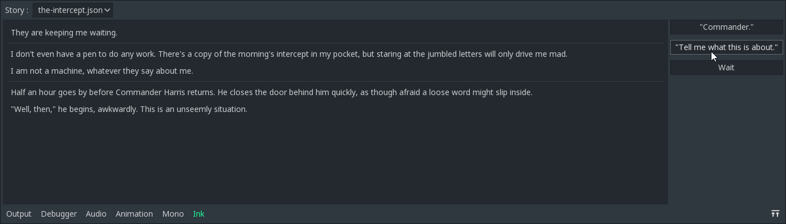
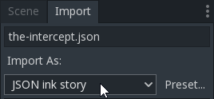

# godot-ink

An [ink](https://github.com/inkle/ink) integration for [Godot Engine](https://github.com/godotengine/godot).  

## How to use

When the plugin is properly loaded, you should be able to use the new ink panel to inspect your story.



You'll also see a new `ink` section in your project settings. If you want to be able to compile your .ink files on the fly you can input the path to the inklecate binary here.  
The last thing you'll need to do in order to get going is to put `ink-engine-runtime.dll` at the root of your Godot project.

---

Everything is handled in a `Story` node.  
If nothing is specified, the **C#** usage is the same as the **GDScript** one.

### Loading the story

First you should navigate to your `.json` or `.ink` file and import it as an `Ink story` in Godot. To do that, select the file in Godot, go to `Import`, select `Ink story` under `Import As:` and click `ReImport`.



To load your story, you can:

* Point the `InkFile` exported variable to your `.json`/`.ink` file and check the `AutoLoadStory` checkbox in the inspector.
* Point the `InkFile` exported variable to your `.json`/`.ink` file (in the inspector or via a script) and call `story.LoadStory()`.

### Running the story and making choices

Getting content from the story is done by calling the `.Continue()` method.
```GDScript
var story = get_node("Story")
while story.CanContinue:
    print(story.Continue())
    # Alternatively, text can be accessed from story.CurrentText
```

Choices are made with the `.ChooseChoiceIndex(int)` method.
```GDScript
if story.HasChoices:
    for choice in story.CurrentChoices:
        print(choice)
    ...
    story.ChooseChoiceIndex(index)
```

### Using signals

If you don't want to bother accessing `CurrentText` and `CurrentChoices`, signals are emitted when the story continues forward and when a new choice appears.

```GDScript
    ...
    story.connect("InkContinued", self, "_on_story_continued")
    story.connect("InkChoices", self, "_on_choices")

func _on_story_continued(currentText, currentTags):
    print(currentText)

func _on_choices(currentChoices):
    for choice in choices:
        print(choice)
```

In **C#**, you can use the `nameof()` on the `[Signal]` delegates.

```C#
story.Connect(nameof(InkStory.InkContinued), this, "OnStoryContinued");
story.Connect(nameof(InkStory.InkChoices), this, "OnChoices");
```

The above signals are also available through the node inspector.

### Save / Load

You get and set the json state by calling `.GetState()` and `.SetState(String)`.

```GDScript
story.SetState(story.GetState())
```

Alternatively you can save and load directly from disk (either by passing a path or a file as argument) with `.LoadStateFromDisk` and `.SaveStateOnDisk`.  
When using a path, the default behaviour is to use the `user://` folder. You can bypass this by passing a full path to the functions (e.g. `res://my_dope_save_file.json`).

```GDScript
story.SaveStateOnDisk("save.json")
story.LoadStateFromDisk("save.json")
```

```GDScript
var file = File.new()
file.open("save.json", File.WRITE)
story.SaveStateOnDisk(file)
file.close


file.open("save.json", File.READ)
story.LoadStateFromDisk(file)
file.close
```

### Tags

Tags, global tags and knot tags are accessible respectively through `.CurrentTags`, `.GlobalTags` and `.TagsForContentAtPath(String)`.

```GDScript
print(story.CurrentTags)
print(story.GlobalTags)
print(story.TagsForContentAtPath("mycoolknot"))
```

As shown above, current tags are also passed along the current text in the `InkContinued` event.

### Jumping to a Knot/Stitch

You can [jump to a particular knot or stitch](https://github.com/inkle/ink/blob/master/Documentation/RunningYourInk.md#jumping-to-a-particular-scene) with `.ChoosePathString(String)`. This method will return `false` if the jump failed.

```GDScript
if story.ChoosePathString("mycoolknot.myradstitch"):
    story.Continue()
```

### Using Ink variables

Ink variables (except InkLists for now) can be get and set.

```GDScript
story.GetVariable("foo")
story.SetVariable("foo", "bar")
```

They can also be observed with signals.

```GDScript
    ...
    story.connect(story.ObserveVariable("foo"), self, "_foo_observer")

func _foo_observer(varName, varValue):
    print(varName, " = ", varValue)
```

#### Read/Visit count

You can know how many times a knot/stitch has been visited with `.VisitCountPathString(String)`.

```GDScript
print(story.VisitCountPathString("mycoolknot.myradstitch"))
```

## Troubleshooting

If you're having trouble enabling the editor plugin, it's probably because the `.cs` files aren't compiling with your project. You can solve the issue by adding this `ItemGroup` to your `.csproj` file.

```xml
<ItemGroup>
    <Compile Include="addons\paulloz.ink\PaullozDotInk.cs" />
    <Compile Include="addons\paulloz.ink\InkDock.cs" />
    <Compile Include="addons\paulloz.ink\Story.cs" />
    <Reference Include="Ink">
        <HintPath>$(ProjectDir)/ink-engine-runtime.dll</HintPath>
        <Private>False</Private>
    </Reference>
</ItemGroup>
```

Depending on the version of Godot you're using, you might still have issues with the editor plugin.  
Do not worry, you don't actually need to enable it to use **godot-ink**. If you don't want to bother with extensive troubleshooting, all you have to do is attach `addons/paulloz.ink/Story.cs` to a node (or use it as a singleton). This node will become the `Story` node for the rest of this documentation.

### TODO:
* Getting/Setting/Observing InkLists
* On the fly Ink to JSON compilation (works on Windows, need some tweaking for Linux and Mac OS support)

## License

**godot-ink** is released under MIT license (see the [LICENSE](/LICENSE) file for more information).
